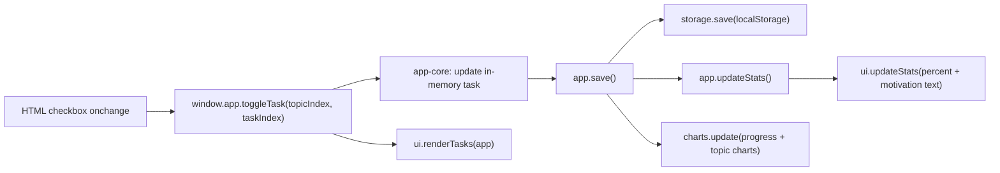
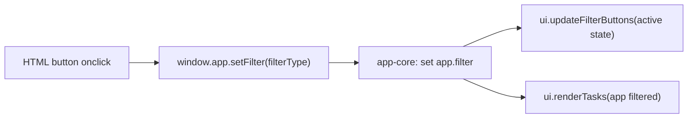
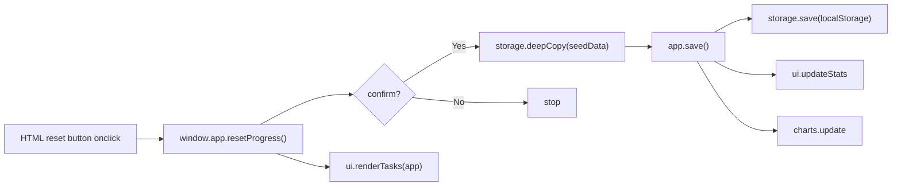

# Preparation-Tracker: Learning Architecture

This project is intentionally split so you can learn how HTML, CSS, and JavaScript work together.

## 1) What each language/file does

- HTML: page structure + imports only
- CSS: visual design (theme, spacing, look)
- JS: behavior, data, rendering, storage, charts

### Main shared files

- `assets/theme.css`: global colors, shared components, theme tokens
- `assets/css/unit-dashboard.css`: unit-page specific utility styles
- `assets/theme.js`: multi-mode background animation engine + theme palette object

## Animation mode map

Background animation is selected per page using:

- `<canvas id="bgCanvas" data-bg-mode="...">`

Current mapping:

1. Dashboard index:
- `index.html` -> `data-bg-mode="math-grid"`
- Vibe: dynamic engineering grid + harmonic curves

2. Course index pages (shared style):
- `Applied-Mathematics-I/index.html` -> `data-bg-mode="parametric"`
- `Applied-Mathematics-II/index.html` -> `data-bg-mode="parametric"`
- Vibe: parametric/Lissajous motion

3. All 8 unit pages (all unique):
- `Applied-Mathematics-I/unit-1.html` -> `vector-field`
- `Applied-Mathematics-I/unit-2.html` -> `contour`
- `Applied-Mathematics-I/unit-3.html` -> `orbit-rings`
- `Applied-Mathematics-I/unit-4.html` -> `radar`
- `Applied-Mathematics-II/unit-1.html` -> `matrix`
- `Applied-Mathematics-II/unit-2.html` -> `particles`
- `Applied-Mathematics-II/unit-3.html` -> `math-grid`
- `Applied-Mathematics-II/unit-4.html` -> `parametric`
- Vibe: each unit has a distinct technical/math motion identity

### Unit app JS layers

- `assets/js/modules/storage.js`: localStorage load/save
- `assets/js/modules/charts.js`: Chart.js init/update
- `assets/js/modules/ui.js`: DOM rendering + filter button UI + motivation text
- `assets/js/modules/app-core.js`: app factory (business flow)
- `assets/js/am*-unit-*.data.js`: syllabus/task data only
- `assets/js/am*-unit-*.main.js`: app bootstrap/wiring only

## 2) Script load order (unit pages)

Each unit page loads JS in this order:

1. `theme.js`
2. `modules/storage.js`
3. `modules/charts.js`
4. `modules/ui.js`
5. `modules/app-core.js`
6. `am*-unit-*.data.js`
7. `am*-unit-*.main.js`

Why this order: each layer depends on the previous one being available.

## 3) How data flows for each action

### A) Toggle task checkbox

### B) Filter button (`All / To Do / Done`)

### C) Reset progress

## 4) Quick mental model

- `data.js` = *what to show*
- `ui.js` = *how to show in DOM*
- `charts.js` = *how to visualize*
- `storage.js` = *how to persist progress*
- `app-core.js` = *how everything is orchestrated*
- `main.js` = *start point per unit page*

## 5) Step-by-step learning path

Use this exact order for one unit (example: `am1-unit-1`) and then repeat for others.

1. Open HTML first:
- `Applied-Mathematics-I/unit-1.html`
- Goal: understand page structure, IDs/classes used by JS, and script import order.

2. Open data file:
- `assets/js/am1-unit-1.data.js`
- Goal: understand how syllabus data is modeled (`topics -> tasks -> completed`).

3. Open main entry:
- `assets/js/am1-unit-1.main.js`
- Goal: see how the app is created and initialized.

4. Open app core:
- `assets/js/modules/app-core.js`
- Goal: understand app methods (`toggleTask`, `setFilter`, `resetProgress`, `save`) and orchestration.

5. Open UI module:
- `assets/js/modules/ui.js`
- Goal: understand DOM rendering (`renderTasks`), button state changes, and motivation text updates.

6. Open charts module:
- `assets/js/modules/charts.js`
- Goal: understand chart setup and update cycle after state changes.

7. Open storage module:
- `assets/js/modules/storage.js`
- Goal: understand how progress is loaded/saved from `localStorage`.

8. Open shared theme files:
- `assets/theme.css`
- `assets/theme.js`
- Goal: understand visual system and mode-based background behavior.

### Suggested mini-practice

1. In a `data.js` file, add one new task and refresh page.
2. In `ui.js`, change a badge class mapping and observe visual change.
3. In `charts.js`, tweak colors or chart options and refresh.
4. In `storage.js`, clear saved data manually and see reset behavior.
5. In `theme.css`, change one palette variable and observe global impact.
6. In a page HTML file, change `data-bg-mode` (`math-grid`, `parametric`, `vector-field`, `particles`, `contour`, `orbit-rings`, `radar`, `matrix`) and observe the result.
