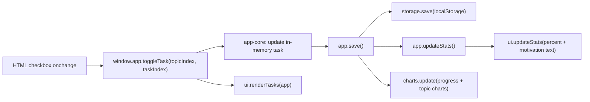
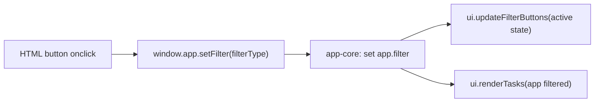
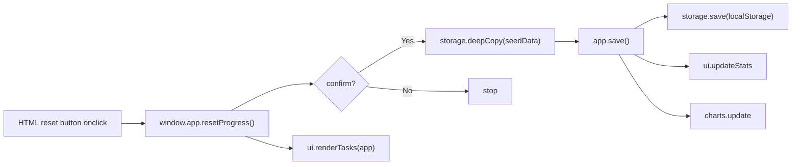

# Preparation-Tracker: Learning Architecture

This project is intentionally split so you can learn how HTML, CSS, and JavaScript work together.

## 1) What each language/file does

- HTML: page structure + imports only
- CSS: visual design (theme, spacing, look)
- JS: behavior, data, rendering, storage, charts

### Main shared files

- `assets/theme.css`: global colors, shared components, theme tokens
- `assets/css/unit-dashboard.css`: unit-page specific utility styles
- `assets/theme.js`: multi-mode background animation engine + theme palette object

## Animation mode map

Background animation is selected per page using:

- `<canvas id="bgCanvas" data-bg-mode="...">`

Current mapping:

1. All pages:
- `data-bg-mode="particles"`
- Vibe: connected particle network

### Unit app JS layers

- `assets/js/modules/storage.js`: localStorage load/save
- `assets/js/modules/cloud-sync.js`: cloud pull/push per storage key (Supabase)
- `assets/js/modules/auth-ui.js`: login page auth interactions
- `assets/js/modules/charts.js`: Chart.js init/update
- `assets/js/modules/ui.js`: DOM rendering + filter button UI + motivation text
- `assets/js/modules/app-core.js`: app factory (business flow)
- `assets/js/am*-unit-*.data.js`: syllabus/task data only
- `assets/js/am*-unit-*.main.js`: app bootstrap/wiring only

## 2) Script load order (unit pages)

Each unit page loads JS in this order:

1. `theme.js`
2. `modules/storage.js`
3. `modules/charts.js`
4. `modules/ui.js`
5. `modules/app-core.js`
6. `am*-unit-*.data.js`
7. `am*-unit-*.main.js`

Why this order: each layer depends on the previous one being available.

## Cloud login + sync setup (cross-device history)

This is implemented with Supabase Auth + Postgres.

### 1) Configure project keys

Edit:
- `assets/js/supabase-config.js`

Set:
- `window.SUPABASE_URL`
- `window.SUPABASE_ANON_KEY`

### 2) Create table for progress

Run this SQL in Supabase SQL Editor:

```sql
create table if not exists public.tracker_progress (
  user_id uuid not null references auth.users(id) on delete cascade,
  storage_key text not null,
  data jsonb not null,
  updated_at timestamptz not null default now(),
  primary key (user_id, storage_key)
);
```

### 3) Enable RLS and user-only access

```sql
alter table public.tracker_progress enable row level security;

create policy "Users can read own progress"
on public.tracker_progress
for select
to authenticated
using (auth.uid() = user_id);

create policy "Users can write own progress"
on public.tracker_progress
for insert
to authenticated
with check (auth.uid() = user_id);

create policy "Users can update own progress"
on public.tracker_progress
for update
to authenticated
using (auth.uid() = user_id)
with check (auth.uid() = user_id);
```

### 4) Use login page

- Open `login.html`
- If new user: open `signup.html` and create account
- Then sign in via `login.html`
- Open any unit page and progress will sync to cloud automatically
- On a new device: sign in and your saved progress is restored

### 5) Header account label

- Top-right `Sign In / Sign Up` label on dashboard/course pages auto-updates to user name after login.
- Name priority:
  1. `full_name` from signup metadata
  2. email prefix (before `@`) fallback

### 6) Account-bound progress behavior

- Progress is saved per `user_id + unit storage_key` in cloud (`tracker_progress` table).
- This means each unit keeps its own independent saved state in your account.
- Example:
  - Completing 3 topics in AMS-I Unit-2 saves only that unit's state.
  - Logging in from another device restores the same AMS-I Unit-2 state.
- Clearing browser history/cache does not delete cloud progress.
- Progress changes only if user updates tasks or presses Reset.
- Sync conflict rule:
  - Local and cloud snapshots are compared using write timestamps.
  - Newer snapshot wins automatically (prevents stale browser state from overwriting fresh data).
  - Empty local state is not pushed to cloud unless user actually starts making progress.

## 3) How data flows for each action

### A) Toggle task checkbox



### B) Filter button (`All / To Do / Done`)



### C) Reset progress



## 4) Quick mental model

- `data.js` = *what to show*
- `ui.js` = *how to show in DOM*
- `charts.js` = *how to visualize*
- `storage.js` = *how to persist progress*
- `app-core.js` = *how everything is orchestrated*
- `main.js` = *start point per unit page*

## 5) Step-by-step learning path

Use this exact order for one unit (example: `am1-unit-1`) and then repeat for others.

1. Open HTML first:
- `Applied-Mathematics-I/unit-1.html`
- Goal: understand page structure, IDs/classes used by JS, and script import order.

2. Open data file:
- `assets/js/am1-unit-1.data.js`
- Goal: understand how syllabus data is modeled (`topics -> tasks -> completed`).

3. Open main entry:
- `assets/js/am1-unit-1.main.js`
- Goal: see how the app is created and initialized.

4. Open app core:
- `assets/js/modules/app-core.js`
- Goal: understand app methods (`toggleTask`, `setFilter`, `resetProgress`, `save`) and orchestration.

5. Open UI module:
- `assets/js/modules/ui.js`
- Goal: understand DOM rendering (`renderTasks`), button state changes, and motivation text updates.

6. Open charts module:
- `assets/js/modules/charts.js`
- Goal: understand chart setup and update cycle after state changes.

7. Open storage module:
- `assets/js/modules/storage.js`
- Goal: understand how progress is loaded/saved from `localStorage`.

8. Open shared theme files:
- `assets/theme.css`
- `assets/theme.js`
- Goal: understand visual system and mode-based background behavior.

### Suggested mini-practice

1. In a `data.js` file, add one new task and refresh page.
2. In `ui.js`, change a badge class mapping and observe visual change.
3. In `charts.js`, tweak colors or chart options and refresh.
4. In `storage.js`, clear saved data manually and see reset behavior.
5. In `theme.css`, change one palette variable and observe global impact.
6. In a page HTML file, change `data-bg-mode` (`math-grid`, `parametric`, `vector-field`, `particles`, `contour`, `orbit-rings`, `radar`, `matrix`) and observe the result.
